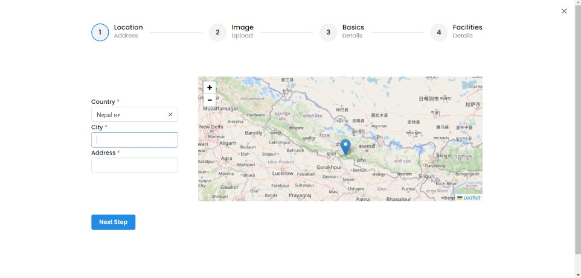
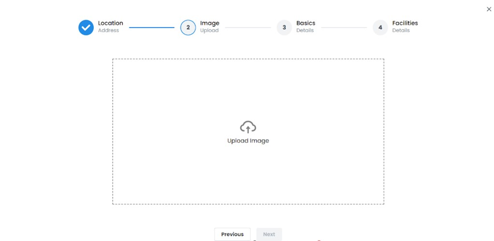
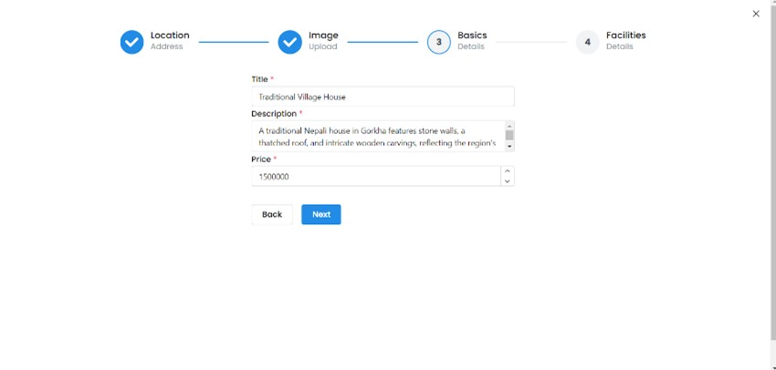
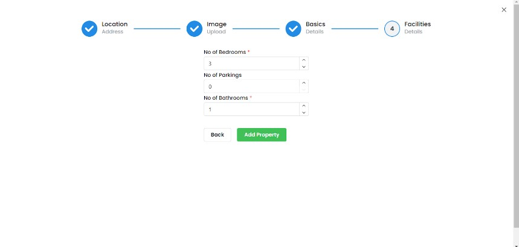
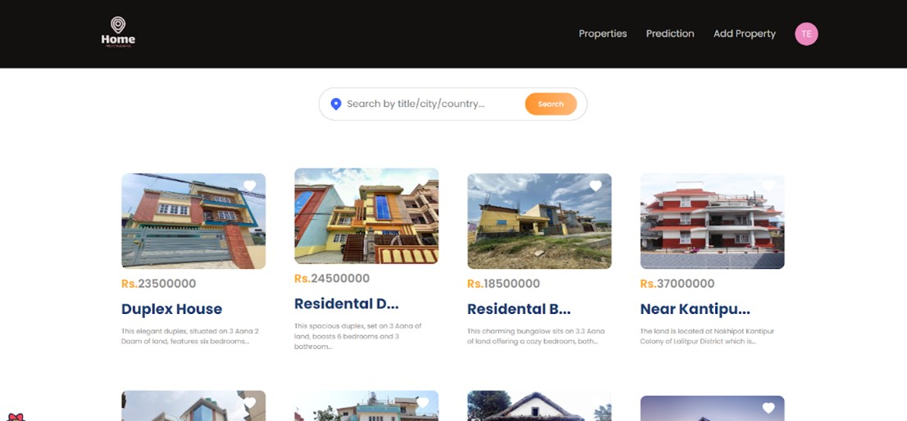
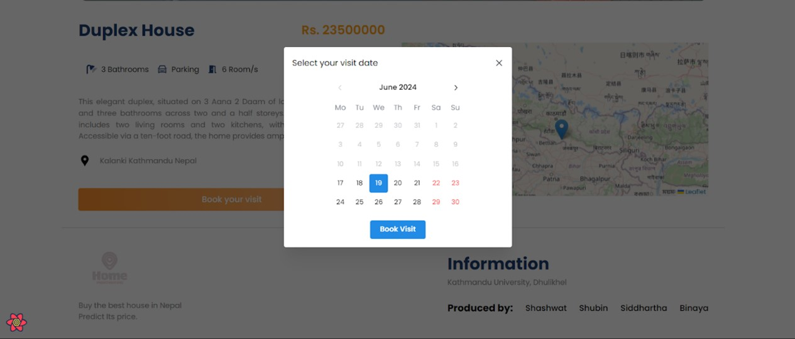
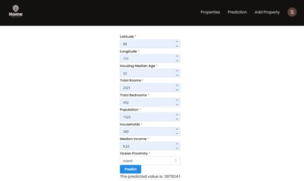

# 🏡 PredictiveEstates

An intelligent real estate platform built with the MERN stack and powered by a machine learning model for house price prediction in Nepal. PredictiveEstates makes property buying, selling, and valuation smarter and more accessible.

---

## 🚀 Features

- 🔍 Predict house prices using ML models
- 🏠 Add, view, and book property listings
- 🌐 Clean, responsive frontend built with React + Vite
- 📦 Scalable backend using Express.js, MongoDB, and Prisma
- 🔐 User authentication with Auth0
- ☁️ Image management via Cloudinary
- 📊 Visualized results and data-driven insights

---

## 🧠 Tech Stack

### Frontend:
- React.js (with Vite)
- Axios
- Tailwind CSS

### Backend:
- Node.js + Express.js
- MongoDB + Prisma
- Auth0 (JWT Authentication)
- Python + Scikit-Learn (ML Model)
- Cloudinary (for image hosting)

---

## 📸 Application Screenshots

| Feature | Screenshot |
|---------|-----------|
| **Homepage** |  |
| **Location** |  |
| **Image Upload** |  |
| **Basic Details** |  |
| **Facilities** |  |
| **Property Page** |  |
| **Single Property Page** |  |
| **Book Visit** |  |
| **Predict Price Page** |  |

---

## 🧠 Authors

- Binaya Raj Thapa  
- Shashwat Khadka 
- Shubin Pokhrel 
- Siddhartha Lal Pradhan

---

### 🔗 Download the Trained Model

[Click here to download model.pkl](https://drive.google.com/drive/folders/1tAmlSpjKBcY9oEwv51xBAQBfgDPpWlyO?usp=sharing)

After downloading, place it in the `MachineLearning/` and `server/` folder.

---

## 📌 Future Enhancements

- Real-time data integration for predictions
- Improved UI/UX for better engagement
- Advanced filtering for properties
- Payment integration
- Native mobile apps (iOS & Android)

---

## Contributing 🤝
Contributions are welcome! If you have any suggestions, bug reports, or feature requests, please open an issue or submit a pull request.

---